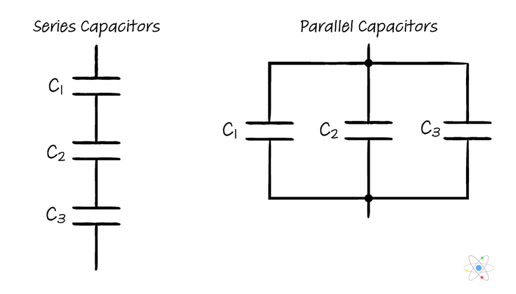

# Capacitors in Circuit

if a single capacitor is in a circuit, we can find the charge needed as long as we have the voltage of the battery source & the capacitance value. but what if there are MULTIPLE capacitors?

When doing circuit analysis, we want to **simplify** the diagram to the point as if it only contains ONE capacitor. Why? It makes it easier to find the current, voltages, etc.&#x20;
