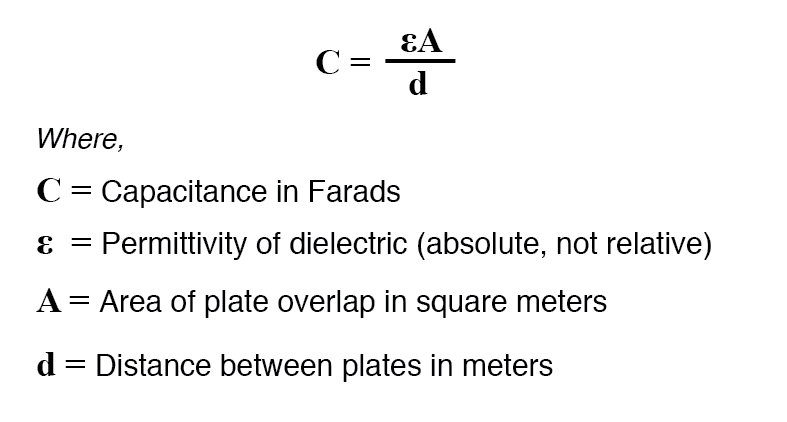

# capacitors

## Capacitance (C)

**q = CV** -> how much charge (q) is needed **to** **produce a certain potential difference (V)** across a capacitor (w/ capacitance C). **Charge ∝ capacitance**, so more charge is needed to create the same ΔV if the capacitance is greater.

Note: The **capacitance (C)** _depends_ _only on the <mark style="color:red;">GEOMETRY</mark> of the capacitor plates_, NOT on the voltage difference or their charge.

* **Area** -> area of just 1 plate
* **ε0** = 8.85 \* 10^-12 C^2/N\*m^2
* derived from **Gauss's Law**, where V = Ed and q = ε0EA. C = q/V = ε0EA/Ed = ε0A/d.

 (1).png>)

### Charging a Capacitor

ok, so how tf do we charge a capacitor in the first place to create a V diff?

Here are some ways:

* put plates in a **circuit w/ a battery**! circuits create current (aka charge/time) that slowly charges up the plates until they reach a V diff equivalent to the battery
* ha. that's it, i guess?

 (1).png>)

Initially, when the plates are **uncharged**, **ΔV between them is 0**!! As they slowly get charged, a **ΔV is generated** (remember equation q = CV, **as q increases so does V**). When the +plate reaches same potential as +battery terminal, and -plate reaches same potential as -battery terminal, there is no electric field left between them. This is when the capacitor is _**fully charged.**_
