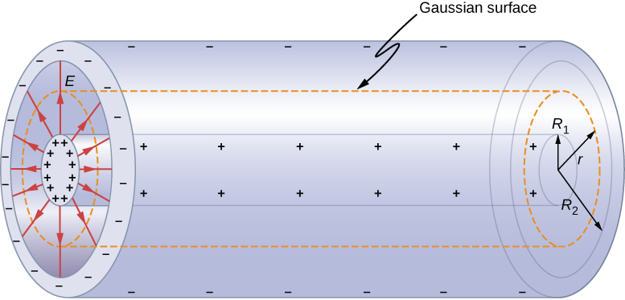

# electric field

### Parallel Plate Capacitors

Using Gauss's Law, the electric field generated across a _**parallel plate** capacitor_ is the **E = Q/(Aε0)**, where Q is the charge of the capacitor and A is the area of surrounding Gaussian surface (usually the area of the capacitor plates, unless otherwise specified in a problem). Here, E is uniform across the capacitor, since its equation does NOT depend on "d."&#x20;

.png>)

### Cylindrical Capacitors

Here, the **electric field generated is NOT uniform**. Using Gauss's Law, we find that  (1).png>)As distance from the axis increases the magnitude of the e-field decreases (makes sense, as gaussian surface is a circle).&#x20;

 (1) (1) (1) (1).png>)                 

This means that the voltage across a cylindrical capacitor is: (1) (1) (1).png>)

And thus, its capacitance can be found with the equation:

 (1) (1) (1).png>)

### Spherical Capacitors

Same thing as above: with gauss's law we find that the e-field varies with the square of distance  (1) (1) (1) (1) (1) (1) (1).png>)

.jpg>)

Voltage:  (1) (1) (1).png>)

Capacitance:  (1) (1) (1) (1) (1).png>)
