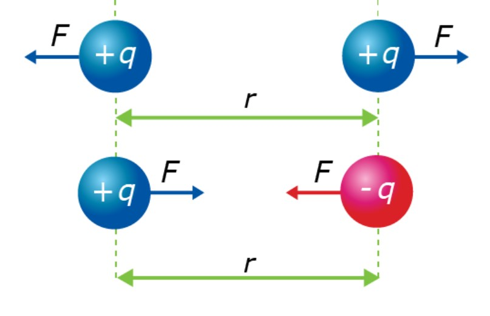

# electric force

Charged particles exert **electric forces** on each other. Between 2 charges, the forces they exert on each other are equal in magnitude and form an **action-reaction pair.** To find the magnitude of the electric force between **2 charges q1 and q2** separated by a **distance r,** use the equation:

.png>)

This is **Coulomb's Law:** the electric force grows weaker with the square of the distance and stronger with increasing charge. To find the direction, remember that the electric force between **opposite charges** is **attractive**. The force between **like charges** is **repulsive**.&#x20;

