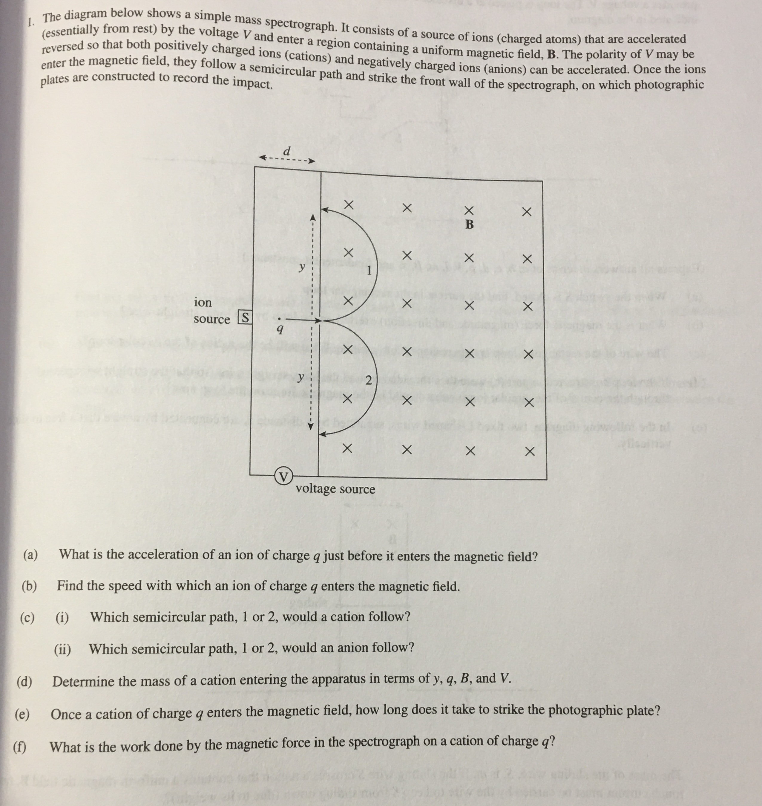

# problem sets

## MCQ

 (1).png>)

Answer: **C**

Remember, torque on the loop is the cross product of the magnetic dipole moment (NiA) and the magnetic field. The direction magnetic dipole moment of the coil is found by using the right-hand rule, which in this case is pointing into the page. Since the dipole moment is antiparallel to the magnetic field B, there is NO torque on the loop in the picture above.&#x20;

In order to get the maximum torque, the dipole moment must be perpendicular (90 degrees) to the magnetic field, since sin(90) = 1. Therefore the loop must be rotated 90 degrees from its current position.

## FRQ

Answer:

.jpg>)
